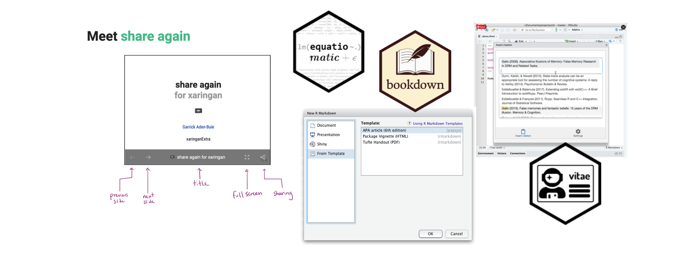
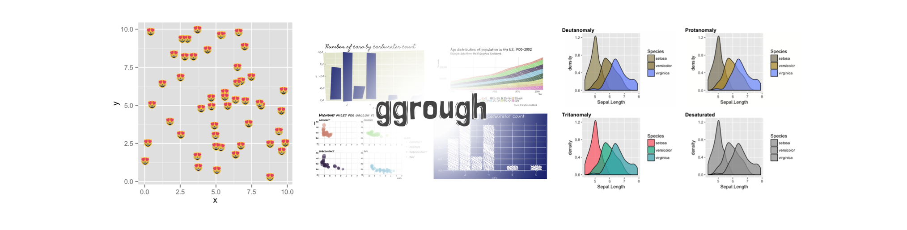
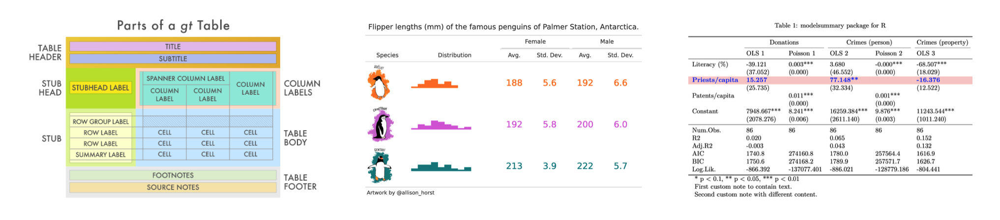
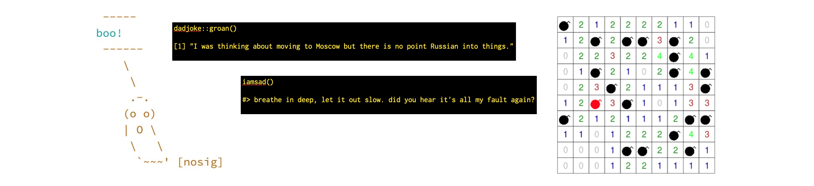

I have written several notes to myself over the years as reminders. These include ideas for research, R packages I have seen and may use sometime), things to-do, etc.  I am in the process of making some of these notes more public on my blog. This will act as a more searchable, curated "note" for myself, but also makes it available to anyone else who would benefit.

## R Packages for Productivity

- [blastula](https://github.com/rstudio/blastula) is a package for creating beautiful custom emails in R. It can be used to compose custom email bodies based on code, code output, and markdown; and send emails using SMTP servers - even GMail - or integrate with production services like RStudio Connect. Also available from CRAN.

 

## Packages to Enhance Markdown Documents

{width=100%}

- [bookdown](https://github.com/rstudio/bookdown) facilitates writing books and long-form articles/reports with R Markdown. There are several examples of books writte in bookdown and documentation available at https://bookdown.org/.
- [citr](https://github.com/crsh/citr) creates an RStudio addin to insert citations in an R Markdown document. 
- [emo](https://github.com/hadley/emo) can be used to easily add emoji into an R Markdown document.
- [equatiomatic](https://github.com/datalorax/equatiomatic) extracts output from the `lm()` function to write the equation using LaTeX.
- [markdowntemplates](https://github.com/hrbrmstr/markdowntemplates) includes a set of R markdown templates and knitr knit engine replacements.
- [papaja](https://github.com/crsh/papaja) can be used to easily prepare APA journal articles with R Markdown.
- [vitae](https://github.com/mitchelloharawild/vitae) makes creating and maintaining a Resume or CV with R Markdown simple. It provides a collection of LaTeX templates, with helpful functions to add content to the documents.
- [xaringan](https://github.com/yihui/xaringan) can be used to produce some slick slideshows with remark.js using R Markdown.
  + [xaringanExtra](https://github.com/gadenbuie/xaringanExtra) is a "playground of enhancements and extensions for xaringan slides". This package also includes functions for [sharing your slides](https://www.garrickadenbuie.com/blog/sharing-xaringan-slides/) on a website or Twitter.
  + [xaringanthemer](https://github.com/gadenbuie/xaringanthemer) adds some style to you xaringan produced slides.

 

## Packages to Enhance Plots

- [colorblindr](https://github.com/clauswilke/colorblindr) can simulate colorblindness in production-ready R figures.
- [emoGG](https://github.com/dill/emoGG) can be used to add emoji into your ggplots.
- [extrafont](https://github.com/wch/extrafont) makes it easier to include system fonts in your plots. Also available from CRAN.
- [ggrough](https://xvrdm.github.io/ggrough/index.html) converts your ggplot2 plots to rough/sketchy charts, using the excellent javascript `roughjs` library.

 

## Packages for Creating Tables

{width=100%}

- [gt](https://gt.rstudio.com/) creates "wonderful-looking tables using the R programming language. The gt philosophy: we can construct a wide variety of useful tables with a cohesive set of table parts. These include the table header, the stub, the column labels and spanner column labels, the table body, and the table footer."
- [kableExtra](https://haozhu233.github.io/kableExtra/) includes functionality to enhance `kable()` tables. There is extensive documentation for producing tables in [HTML](https://cran.r-project.org/web/packages/kableExtra/vignettes/awesome_table_in_html.html) and [LaTeX](https://haozhu233.github.io/kableExtra/awesome_table_in_pdf.pdf).
- [modelsummary](https://github.com/vincentarelbundock/modelsummary) creates "tables and plots to summarize statistical models and data". These tables are also customizable.
- [stargazer](https://www.jakeruss.com/cheatsheets/stargazer/) can be used to create tables of regression model output.
- [stargazer-booktabs](https://github.com/markwestcott34/stargazer-booktabs) is a slightly modified version of the stargazer package which outputs tables using the booktabs (LaTeX) commands (`\toprule`, `\midrule`, and `\bottomrule`) to include horizontal rules.

 

## Fun R Packages

{width=100%}

- [cowsay](https://github.com/sckott/cowsay) creates a message accompanied by ASCII animal art. Also available from CRAN.
- [dadjoke](https://github.com/jhollist/dadjoke/) produces dad jokes with the `groan()` function.
- [emokid](https://github.com/itsrainingdata/emokid) outputs some emo messages when "you're having trouble expressing how you feel about your broken code."
- [fortunes](https://cran.r-project.org/web/packages/fortunes/index.html) includes a collection of fortunes and wisdom from the R community. Available from CRAN.
- [fun](https://yihui.org/en/2011/08/the-fun-package-use-r-for-fun/) allows you to play minesweeper in R, among other things. Also available from CRAN.
- [Play Zork in R](https://coolbutuseless.github.io/2020/11/15/play-zork-in-rstats/) This blog post gives some code to load infocom games via Frotz and play them in the R console.

