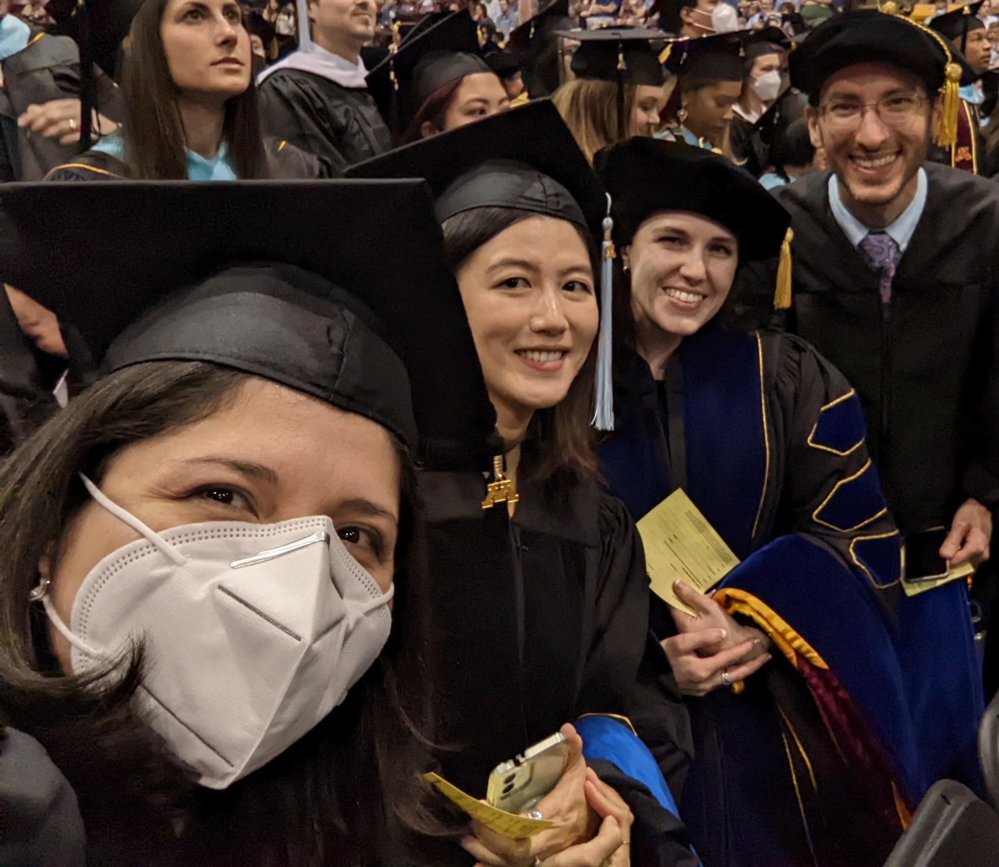
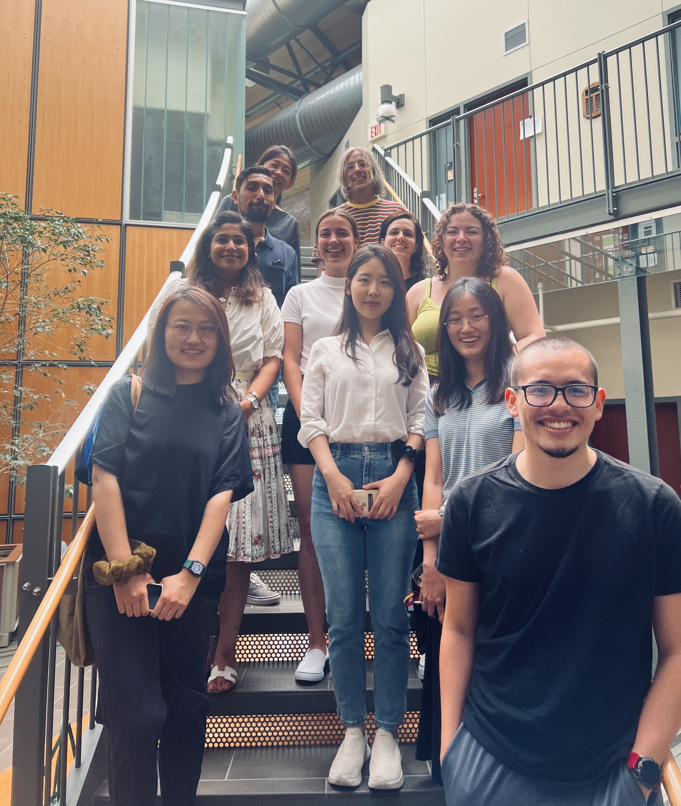

Here are a couple of pictures from the University of Minnesota's 2022 commencement. Two of our statistics education students walked and were hooded: Chelsey Legacy and Jonathan Brown! 

<figure>

<figcaption style="text-align:center;">From Left: Mireya Smith, Yoo Jeong Jang, Chelsey Legacy, and Jonathan Brown.</figcaption>
</figure>

Statistics Education also had a good presence at the 2022 Student Orientation. Regina Lisinker, a second year MA student, and Pablo Vivas Corrales, a first year MA student from Costa Rica, were on hand to welcome in the new academic year. In addition, we also welcomed new QME faculty including Chelsey Legacy, who started as an Assistant Professor of Teaching in the QME program.

<figure>

<figcaption style="text-align:center;">QME students and faculty at the 2022 Fall Department of Educational Psychology new student orientation.</figcaption>
</figure>

